# I2CE Lab Homepage Visuals

Editorial assets for the I2CE Lab homepage redesign. Five projects, three sizes each (hero 1600x900, card 800x600, thumb 240x150). All PNG, no JPEG.

Palette: paper `#f4efe8`, coral accent `#e85a3c`, near black ink `#1a1814`, muted `#7a7269`. Type: IBM Plex Mono for labels, Newsreader italic for hero numerals, IBM Plex Sans for body. Every visual carries a bottom left metadata strip.

## Project table

| Project | Hero | Card | Thumb | Caption |
|---|---|---|---|---|
| **AFCN — Real Time Surplus** | 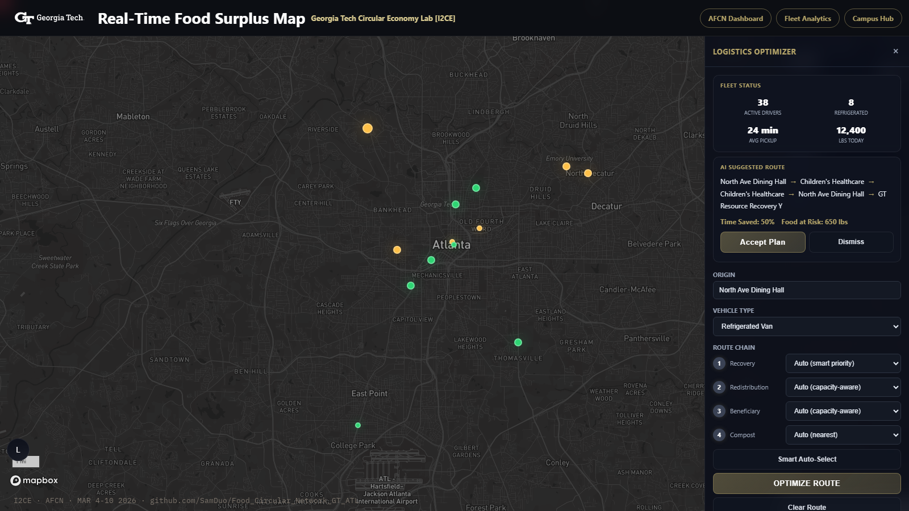 | 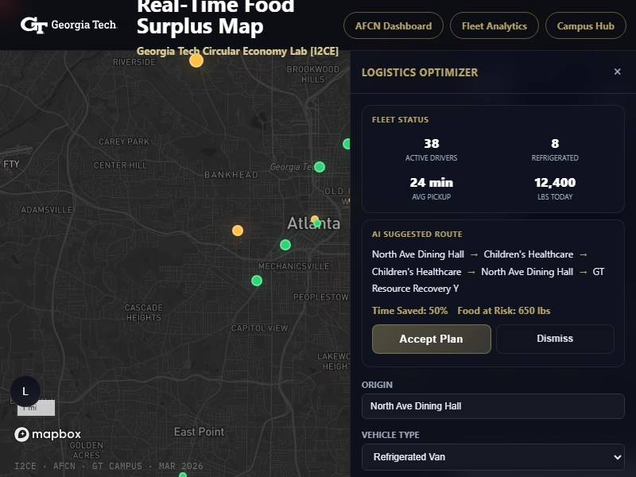 | 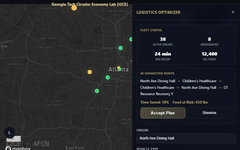 | A real time spatial intelligence dashboard mapping surplus food across the GT campus with urgency aware route optimization. |
| **AFCN — Citywide Dashboard** | 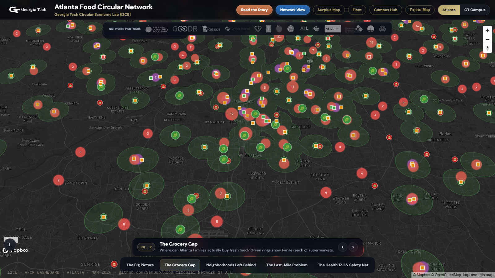 | 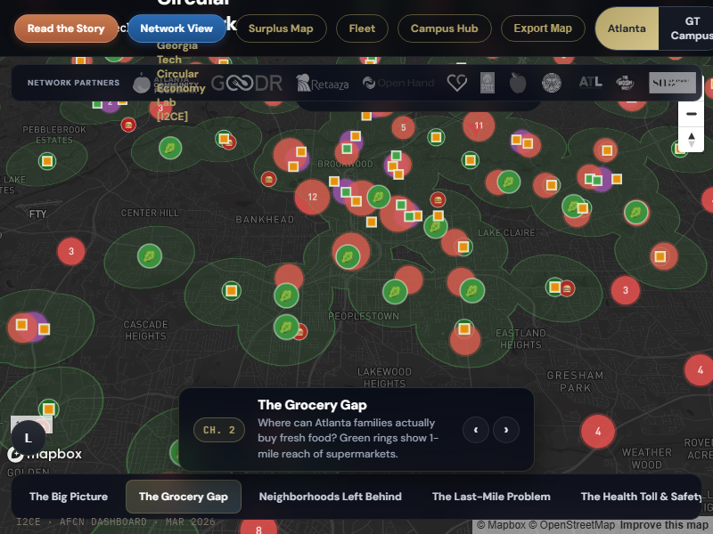 | 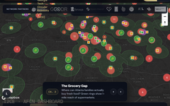 | A citywide platform mapping 11,314 food recovery sources, 2,629 redistribution nodes, and the circular economy infrastructure of metro Atlanta. |
| **Polymetron** | 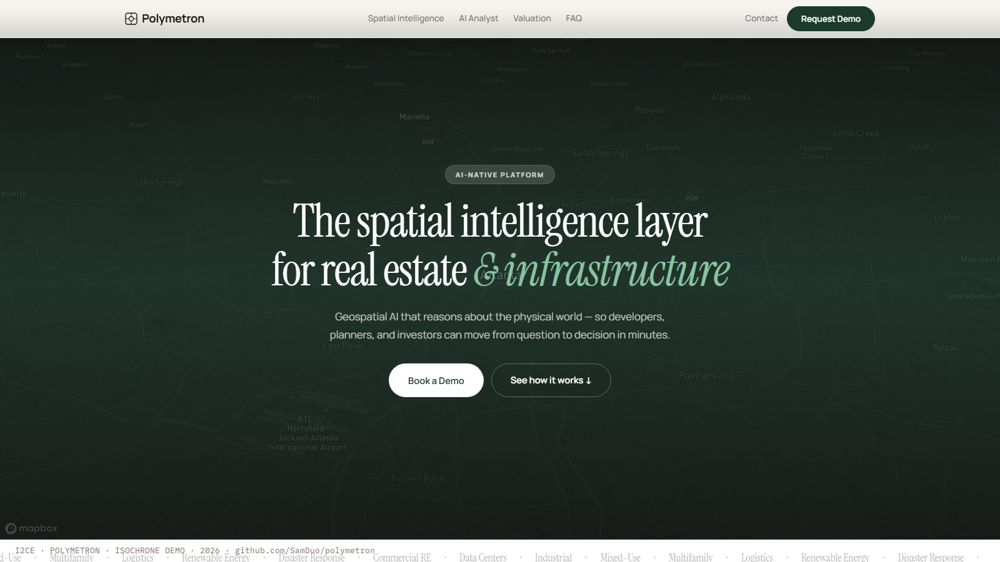 | 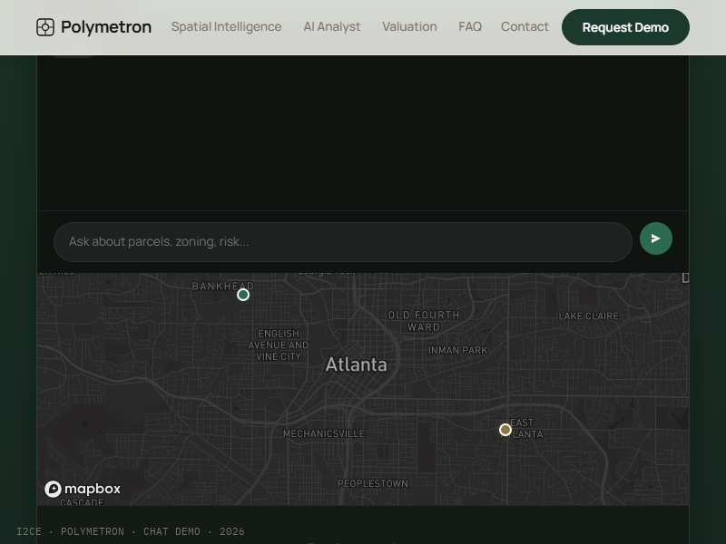 | 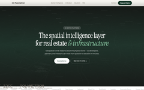 | A spatial intelligence platform fusing geospatial analysis with agentic AI for real estate and infrastructure development. |
| **LeanPath** | 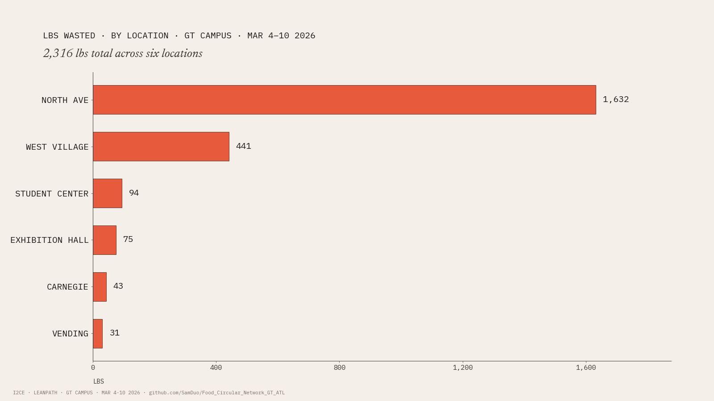 | 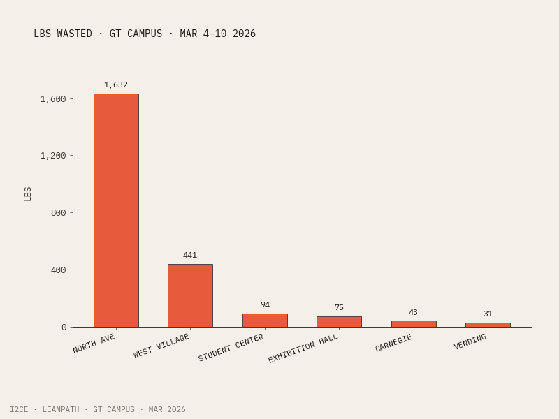 | 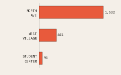 | One week of LeanPath data shows 70 percent of GT campus food waste concentrates at a single location, North Ave. |
| **Compost Atlas** | 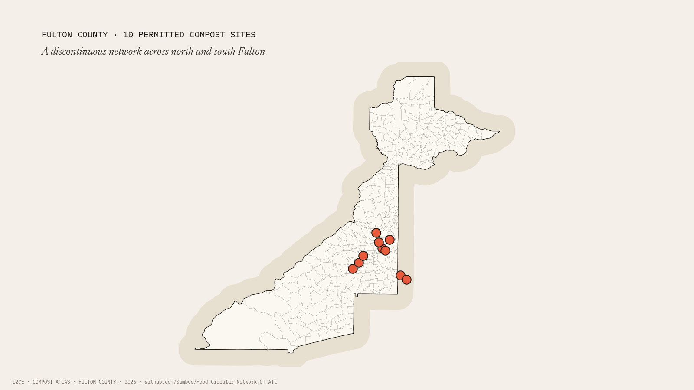 | 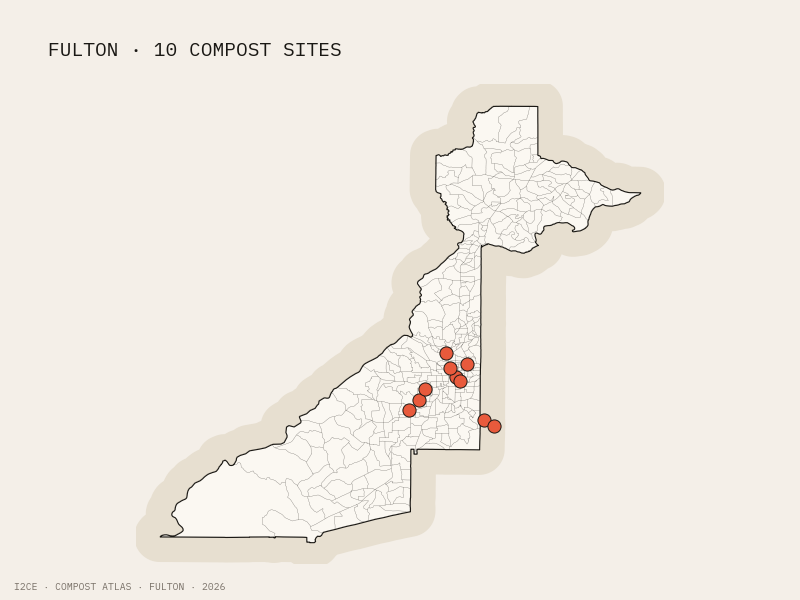 | 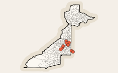 | Ten permitted compost and circular economy sites across Fulton County, concentrated in the city of Atlanta and the south Fulton corridor. |

## Production notes

- **AFCN, AFCN Dashboard, Polymetron** were captured with Playwright using a system Chrome binary at `C:\Program Files\Google\Chrome\Application\chrome.exe`. The local AFCN dev server `Python Script/serve.py` was running on port 8080. Polymetron was served via `python -m http.server 8090` after a clone of `github.com/SamDuo/polymetron`.
- **LeanPath** is matplotlib generated from real LeanPath GT campus values for March 4 to 10, 2026.
- **Compost Atlas** is matplotlib + geopandas. The Fulton County outline is dissolved from the 327 census tracts in `census_tracts_tiger.geojson` where `COUNTYFP = 121`. The 10 sites are point geometries from `circular_economy.geojson`.

## Style enforcement

- All metadata strips in the bottom left use IBM Plex Mono.
- Coral `#e85a3c` is reserved for the AFCN urgency pins, the LeanPath bars, and the compost site pins. Not used decoratively elsewhere.
- No drop shadows, no gradients, no rounded corners larger than 2px.
- No stock illustrations or icon library glyphs.
- No GT or I2CE logos in the visuals themselves. Page chrome handles branding.

## File sizes

| Project | Hero | Card | Thumb |
|---|---:|---:|---:|
| AFCN | ~830 KB | ~240 KB | ~35 KB |
| AFCN Dashboard | ~1.2 MB | ~410 KB | ~55 KB |
| Polymetron | ~1.1 MB | ~130 KB | ~35 KB |
| LeanPath | ~45 KB | ~25 KB | ~3 KB |
| Compost Atlas | ~125 KB | ~70 KB | ~14 KB |
